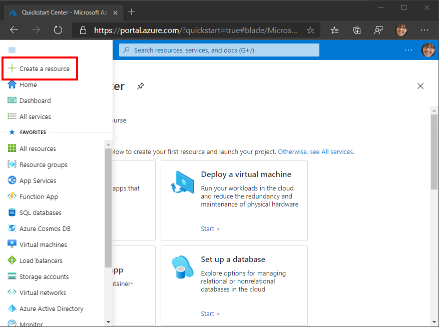
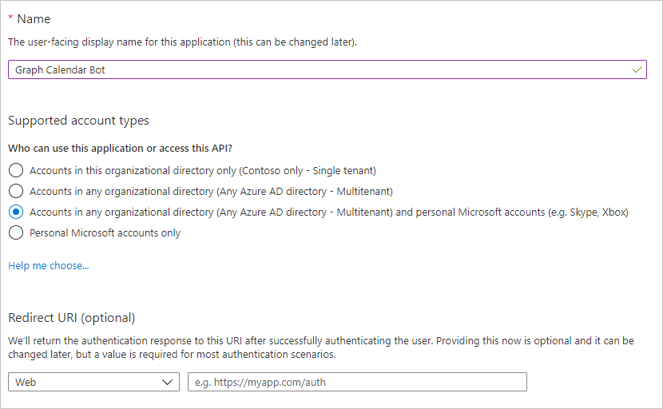

<!-- markdownlint-disable MD002 MD041 -->

En este ejercicio, creará un registro nuevo de los canales de Bot y un registro de aplicaciones Web de Azure AD mediante Azure portal.

## Crear un registro de canales de bot

1. Abra un explorador y vaya a [Azure portal](https://portal.azure.com). Inicie sesión con la cuenta asociada a su suscripción de Azure.

1. Seleccione el menú superior izquierdo y, a continuación, seleccione **crear un recurso**.

    

1. En la página **nueva** , busque `Bot Channel` y seleccione el **registro** de los canales de bot?

1. En la página **registro de canales de bot** , seleccione **crear**.

1. Rellene los campos obligatorios y deje el **punto de conexión de mensajería** en blanco. El campo de **control de bot** debe ser único. Asegúrese de revisar los diferentes niveles de precios y seleccione qué tiene sentido en su escenario. Si este es solo un ejercicio de aprendizaje, puede que quiera seleccionar la opción gratuita.

1. Seleccione el **identificador de aplicación y la contraseña de Microsoft y**, después, seleccione **crear nuevo**.

1. Seleccione **Crear identificador de aplicación en el portal de registro de la aplicación**. Se abrirá una nueva ventana o pestaña en la hoja **registros** de la aplicación en Azure portal.

1. En la hoja **registros de aplicaciones** , seleccione **nuevo registro**.

1. Establezca los valores de la siguiente manera.

    - Establezca **Nombre** como `Graph Calendar Bot`.
    - Establezca **Tipos de cuenta admitidos** en **Cuentas en cualquier directorio de organización y cuentas personales de Microsoft**.
    - Deje **URI de redireccionamiento** vacía.

    

1. Seleccione **Registrar**. En la página de **Bot calendario de Graph** , copie el valor del identificador de la **aplicación (cliente)** y guárdelo, lo necesitará en los pasos siguientes.

    

1. Seleccione **Certificados y secretos** en **Administrar**. Seleccione el botón **Nuevo secreto de cliente**. Escriba un valor en **Descripción** y seleccione una de las opciones para **Expires** y seleccione **Agregar**.

1. Copie el valor del secreto de cliente antes de salir de esta página. Lo necesitará en los siguientes pasos.

    > [!IMPORTANT]
    > El secreto de cliente no se vuelve a mostrar, así que asegúrese de copiarlo en este momento. Tendrá que escribir este valor en varios lugares para mantenerlo seguro.

1. Vuelva a la ventana de registro del canal de bot en el explorador y pegue el identificador de la aplicación en el campo **identificador de aplicación de Microsoft** . Pegue el secreto de cliente en el campo **contraseña** . Seleccione **ACEPTAR**.

1. En la página de registro de los **canales de bots** , seleccione **crear**.

1. Espere a que se cree el registro de los canales de bot? Una vez creado, vuelva a la Página principal de Azure portal y, a continuación, seleccione **servicios de bot**. Seleccione el nuevo registro de canal bots para ver sus propiedades.

## Creación de un registro de aplicaciones Web

1. Vuelva a la sección **registros de aplicaciones** de Azure portal.

1. Seleccione **Nuevo registro**. En la página **Registrar una aplicación**, establezca los valores siguientes.

    - Establezca **Nombre** como `Graph Calendar Bot Auth`.
    - Establezca **Tipos de cuenta admitidos** en **Cuentas en cualquier directorio de organización y cuentas personales de Microsoft**.
    - En **URI de redirección**, establezca la primera lista desplegable en `Web` y establezca el valor `https://token.botframework.com/.auth/web/redirect`.

1. Seleccione **Registrar**. En la página **autenticación de bot de calendario de Graph** , copie el valor del identificador de la **aplicación (cliente)** y guárdelo, lo necesitará en los pasos siguientes.

1. Seleccione **Certificados y secretos** en **Administrar**. Seleccione el botón **Nuevo secreto de cliente**. Escriba un valor en **Descripción** y seleccione una de las opciones para **Expires** y seleccione **Agregar**.

1. Copie el valor del secreto de cliente antes de salir de esta página. Lo necesitará en los siguientes pasos.

1. Seleccione **permisos de API** y, a continuación, seleccione **Agregar un permiso**.

1. Seleccione **Microsoft Graph** y, a continuación, seleccione **permisos delegados**.

1. Seleccione los siguientes permisos y, a continuación, seleccione **Agregar permisos**.

    - **openid**
    - **profile**
    - **Calendars.ReadWrite**
    - **MailboxSettings.Read**

    

### Acerca de los permisos

Considere lo que cada uno de esos ámbitos de permisos permite que el bot haga y lo que el bot usará para ellos.

- **OpenID** y **Profile**: permite que el bot inicie sesión en los usuarios y obtenga información básica de Azure ad en el token de identidad.
- **Calendars. ReadWrite**: permite al bot leer el calendario del usuario y agregar nuevos eventos al calendario del usuario.
- **MailboxSettings. Read**: permite al bot leer la configuración del buzón de correo del usuario. El bot usará esto para obtener la zona horaria seleccionada del usuario.
- **User. Read**: permite al bot obtener el perfil del usuario de Microsoft Graph. El bot usará esto para obtener el nombre del usuario.

## Agregar conexión OAuth al bot

1. Navegue hasta la página de registro de los canales de bot de bot en Azure portal. Seleccione **configuración** en **Administración de bot**.

1. En **configuración de conexión de OAuth** cerca de la parte inferior de la página, seleccione **Agregar configuración**.

1. Rellene el formulario como sigue y, a continuación, seleccione **Guardar**.

    - **Name**: `GraphBotAuth`
    - **Proveedor**: **Azure Active Directory V2**
    - **Identificador de cliente**: el identificador de aplicación del registro de **autenticación de bot de calendario de Graph** .
    - **Secreto de cliente**: el secreto de cliente del registro de **autenticación de bot de calendario de Graph** .
    - **Dirección URL de intercambio de token**: dejar en blanco
    - **Identificador de inquilino**: `common`
    - **Ámbitos**: `openid profile Calendars.ReadWrite MailboxSettings.Read User.Read`

1. Seleccione la entrada **GraphBotAuth** en **configuración de conexión de OAuth**.

1. Seleccione **probar conexión**. Se abrirá una nueva ventana o ficha del explorador para iniciar el flujo de OAuth.

1. Si es necesario, inicie sesión. Revise la lista de permisos solicitados y, después, seleccione **Aceptar**.

1. Debe ver un mensaje de **prueba de conexión a ' GraphBotAuth ' correcta** .

> [!TIP]
> Puede seleccionar el botón **copiar token** en esta página y pegar el token en [https://jwt.ms](https://jwt.ms) para ver las notificaciones dentro del token. Esto es útil al solucionar problemas de errores de autenticación.
