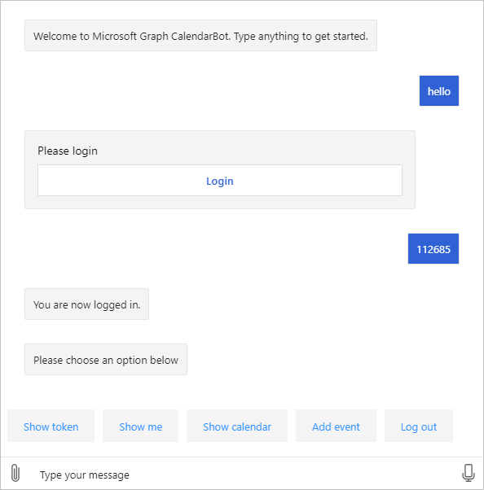

<!-- markdownlint-disable MD002 MD041 -->

En este ejercicio usará el **OAuthPrompt** del marco de robots para implementar la autenticación en el bot y adquirir tokens de acceso para llamar a la API de Microsoft Graph.

1. Abra **./appsettings.jsen** y realice los siguientes cambios.

    - Cambie el valor de `MicrosoftAppId` al identificador de aplicación del registro de la aplicación de **Bot de calendario de Graph** .
    - Cambie el valor de `MicrosoftAppPassword` al secreto de cliente del **Bot de calendario de Graph** .
    - Agregue un valor denominado `ConnectionName` con un valor de `GraphBotAuth` .

    :::code language="json" source="../demo/GraphCalendarBot/appsettings.example.json":::

    > [!NOTE]
    > Si usó un valor distinto de `GraphBotAuth` para el nombre de la entrada en **configuración de conexión de OAuth** en el portal de Azure, use ese valor para la `ConnectionName` entrada.

## <a name="implement-dialogs"></a>Implementación de cuadros de diálogo

1. Cree un nuevo directorio en la raíz del proyecto denominado **Dialogs**. Cree un archivo nuevo en el directorio **./Dialogs** denominado **LogoutDialog.CS** y agregue el siguiente código.

    :::code language="csharp" source="../demo/GraphCalendarBot/Dialogs/LogoutDialog.cs" id="LogoutDialogSnippet":::

    Este cuadro de diálogo proporciona una clase base para todos los demás cuadros de diálogo del bot del que se deriva. Esto permite al usuario cerrar sesión sin importar dónde se encuentran en los cuadros de diálogo del bot.

1. Cree un archivo nuevo en el directorio **./Dialogs** denominado **MainDialog.CS** y agregue el siguiente código.

    ```csharp
    using System.Collections.Generic;
    using System.Threading;
    using System.Threading.Tasks;
    using Microsoft.Bot.Builder;
    using Microsoft.Bot.Builder.Dialogs;
    using Microsoft.Bot.Builder.Dialogs.Choices;
    using Microsoft.Bot.Schema;
    using Microsoft.Extensions.Configuration;
    using Microsoft.Extensions.Logging;

    namespace CalendarBot.Dialogs
    {
        public class MainDialog : LogoutDialog
        {
            const string NO_PROMPT = "no-prompt";
            protected readonly ILogger _logger;

            public MainDialog(IConfiguration configuration, ILogger<MainDialog> logger)
                : base(nameof(MainDialog), configuration["ConnectionName"])
            {
                _logger = logger;

                // OAuthPrompt dialog handles the authentication and token
                // acquisition
                AddDialog(new OAuthPrompt(
                    nameof(OAuthPrompt),
                    new OAuthPromptSettings
                    {
                        ConnectionName = ConnectionName,
                        Text = "Please login",
                        Title = "Login",
                        Timeout = 300000, // User has 5 minutes to login
                    }));

                AddDialog(new ChoicePrompt(nameof(ChoicePrompt)));

                AddDialog(new WaterfallDialog(nameof(WaterfallDialog), new WaterfallStep[]
                {
                    LoginPromptStepAsync,
                    ProcessLoginStepAsync,
                    PromptUserStepAsync,
                    CommandStepAsync,
                    ProcessStepAsync,
                    ReturnToPromptStepAsync
                }));

                // The initial child Dialog to run.
                InitialDialogId = nameof(WaterfallDialog);
            }

            private async Task<DialogTurnResult> LoginPromptStepAsync(
                WaterfallStepContext stepContext,
                CancellationToken cancellationToken)
            {
                // If we're going through the waterfall a second time, don't do an extra OAuthPrompt
                var options = stepContext.Options?.ToString();
                if (options == NO_PROMPT)
                {
                    return await stepContext.NextAsync(cancellationToken: cancellationToken);
                }

                return await stepContext.BeginDialogAsync(nameof(OAuthPrompt), null, cancellationToken);
            }

            private async Task<DialogTurnResult> ProcessLoginStepAsync(
                WaterfallStepContext stepContext,
                CancellationToken cancellationToken)
            {
                // If we're going through the waterfall a second time, don't do an extra OAuthPrompt
                var options = stepContext.Options?.ToString();
                if (options == NO_PROMPT)
                {
                    return await stepContext.NextAsync(cancellationToken: cancellationToken);
                }

                // Get the token from the previous step. If it's there, login was successful
                if (stepContext.Result != null)
                {
                    var tokenResponse = stepContext.Result as TokenResponse;
                    if (!string.IsNullOrEmpty(tokenResponse?.Token))
                    {
                        await stepContext.Context.SendActivityAsync(
                            MessageFactory.Text("You are now logged in."), cancellationToken);
                        return await stepContext.NextAsync(null, cancellationToken);
                    }
                }

                await stepContext.Context.SendActivityAsync(
                    MessageFactory.Text("Login was not successful please try again."), cancellationToken);
                return await stepContext.EndDialogAsync();
            }

            private async Task<DialogTurnResult> PromptUserStepAsync(
                WaterfallStepContext stepContext,
                CancellationToken cancellationToken)
            {
                var options = new PromptOptions
                {
                    Prompt = MessageFactory.Text("Please choose an option below"),
                    Choices = new List<Choice> {
                        new Choice { Value = "Show token" },
                        new Choice { Value = "Show me" },
                        new Choice { Value = "Show calendar" },
                        new Choice { Value = "Add event" },
                        new Choice { Value = "Log out" },
                    }
                };

                return await stepContext.PromptAsync(
                    nameof(ChoicePrompt),
                    options,
                    cancellationToken);
            }

            private async Task<DialogTurnResult> CommandStepAsync(
                WaterfallStepContext stepContext,
                CancellationToken cancellationToken)
            {
                // Save the command the user entered so we can get it back after
                // the OAuthPrompt completes
                var foundChoice = stepContext.Result as FoundChoice;
                // Result could be a FoundChoice (if user selected a choice button)
                // or a string (if user just typed something)
                stepContext.Values["command"] = foundChoice?.Value ?? stepContext.Result;

                // There is no reason to store the token locally in the bot because we can always just call
                // the OAuth prompt to get the token or get a new token if needed. The prompt completes silently
                // if the user is already signed in.
                return await stepContext.BeginDialogAsync(nameof(OAuthPrompt), null, cancellationToken);
            }

            private async Task<DialogTurnResult> ProcessStepAsync(
                WaterfallStepContext stepContext,
                CancellationToken cancellationToken)
            {
                if (stepContext.Result != null)
                {
                    var tokenResponse = stepContext.Result as TokenResponse;

                    // If we have the token use the user is authenticated so we may use it to make API calls.
                    if (tokenResponse?.Token != null)
                    {
                        var command = ((string)stepContext.Values["command"] ?? string.Empty).ToLowerInvariant();

                        if (command.StartsWith("show token"))
                        {
                            // Show the user's token - for testing and troubleshooting
                            // Generally production apps should not display access tokens
                            await stepContext.Context.SendActivityAsync(
                                MessageFactory.Text($"Your token is: {tokenResponse.Token}"),
                                cancellationToken);
                        }
                        else if (command.StartsWith("show me"))
                        {
                            await stepContext.Context.SendActivityAsync(
                                MessageFactory.Text("I don't know how to do this yet!"),
                                cancellationToken);
                        }
                        else if (command.StartsWith("show calendar"))
                        {
                            await stepContext.Context.SendActivityAsync(
                                MessageFactory.Text("I don't know how to do this yet!"),
                                cancellationToken);
                        }
                        else if (command.StartsWith("add event"))
                        {
                            await stepContext.Context.SendActivityAsync(
                                MessageFactory.Text("I don't know how to do this yet!"),
                                cancellationToken);
                        }
                        else
                        {
                            await stepContext.Context.SendActivityAsync(
                                MessageFactory.Text("I'm sorry, I didn't understand. Please try again."),
                                cancellationToken);
                        }
                    }
                }
                else
                {
                    await stepContext.Context.SendActivityAsync(
                        MessageFactory.Text("We couldn't log you in. Please try again later."),
                        cancellationToken);
                    return await stepContext.EndDialogAsync(cancellationToken: cancellationToken);
                }

                // Go to the next step
                return await stepContext.NextAsync(cancellationToken: cancellationToken);
            }

            private async Task<DialogTurnResult> ReturnToPromptStepAsync(
                WaterfallStepContext stepContext,
                CancellationToken cancellationToken)
            {
                // Restart the dialog, but skip the initial login prompt
                return await stepContext.ReplaceDialogAsync(InitialDialogId, NO_PROMPT, cancellationToken);
            }
        }
    }
    ```

    Tómese un momento para revisar este código.

    - En el constructor, se configura una [WaterfallDialog](https://docs.microsoft.com/azure/bot-service/bot-builder-concept-waterfall-dialogs?view=azure-bot-service-4.0) con un conjunto de pasos que se producen en orden.
        - En `LoginPromptStepAsync` él envía un **OAuthPrompt**. Si el usuario no ha iniciado sesión, se enviará un mensaje de la interfaz de usuario al usuario.
        - En `ProcessLoginStepAsync` it comprueba si el inicio de sesión se ha realizado correctamente y envía una confirmación.
        - En `PromptUserStepAsync` se envía un **ChoicePrompt** con los comandos disponibles.
        - `CommandStepAsync`Guarda la elección del usuario y, a continuación, reenvía un **OAuthPrompt**.
        - En `ProcessStepAsync` este ejemplo, realiza acciones basadas en el comando recibido.
        - En `ReturnToPromptStepAsync` él inicia la cascada, pero pasa una marca para omitir el inicio de sesión de usuario inicial.

## <a name="update-calendarbot"></a>Actualizar CalendarBot

El paso siguiente es actualizar **CalendarBot** para usar estos nuevos cuadros de diálogo.

1. Abra **./bots/CalendarBot.CS** y reemplace todo el contenido por el código siguiente.

    :::code language="csharp" source="../demo/GraphCalendarBot/Bots/CalendarBot.cs" id="CalendarBotSnippet":::

    Este es un breve resumen de los cambios.

    - Se ha cambiado la clase **CalendarBot** para que sea una clase de plantilla y recibe un **cuadro de diálogo**.
    - Se ha cambiado la clase **CalendarBot** para extender **TeamsActivityHandler**, lo que permite iniciar sesión en Microsoft Teams.
    - Se agregaron reemplazos de método adicionales para habilitar la autenticación.

## <a name="update-startupcs"></a>Actualizar Startup.cs

El último paso consiste en actualizar el `ConfigureServices` método para agregar los servicios necesarios para la autenticación y el nuevo cuadro de diálogo.

1. Abra **./startup.CS** y quite la `services.AddTransient<IBot, Bots.CalendarBot>();` línea del `ConfigureServices` método.

1. Inserte el siguiente código al final del `ConfigureServices` método.

    :::code language="csharp" source="../demo/GraphCalendarBot/Startup.cs" id="ConfigureServiceSnippet":::

## <a name="test-authentication"></a>Probar la autenticación

1. Guarde todos los cambios e inicie el bot con `dotnet run` .

1. Abra el emulador de bot Framework. Seleccione el menú **archivo** y, a continuación, **nueva configuración de bot.**

1. Rellene los campos como se indica a continuación.

    - **Nombre de bot:**`CalendarBot`
    - **Dirección URL del extremo:**`https://localhost:3978/api/messages`
    - IDENTIFICADOR de aplicación de **Microsoft:** el identificador de aplicación del registro de la aplicación de **Bot de calendario de Graph**
    - **Contraseña de aplicación de Microsoft:** el secreto de cliente del **Bot de calendario de Graph**
    - **Cifrar las claves almacenadas en la configuración de bot:** Preparado

    

1. Seleccione **Guardar y conectar**. Una vez que el emulador se conecte, verá `Welcome to Microsoft Graph CalendarBot. Type anything to get started.`

1. Escriba texto y envíelo al bot. El bot responde con un mensaje de inicio de sesión.

1. Seleccione el botón **iniciar sesión** . El emulador le pedirá que confirme la dirección URL que comienza con `oauthlink://https://token.botframeworkcom` . Seleccione **confirmar** para continuar.

1. En la ventana emergente, inicie sesión con su cuenta de Microsoft 365. Revise los permisos solicitados y acepte.

1. Una vez completada la autenticación y el consentimiento, la ventana emergente proporciona un código de validación. Copie el código y cierre la ventana.

    

1. Escriba el código de validación en la ventana chat para completar el inicio de sesión.

    

1. Si selecciona el botón **Mostrar token** (o tipo `show token` ), el bot muestra el token de acceso. El botón **Cerrar sesión** (o escritura `log out` ) cerrará la sesión.

> [!TIP]
> Puede recibir el siguiente mensaje de error en el emulador de bot Framework al iniciar una conversación con el bot.
>
> ```text
> Failed to generate an actual sign-in link: Error: Failed to connect to ngrok instance for OAuth postback URL:
> FetchError: request to http://127.0.0.1:4041/api/tunnels failed, reason: connect ECONNREFUSED 127.0.0.1:4041
> ```
>
> Si esto ocurre, cierre el emulador y reinícielo.
