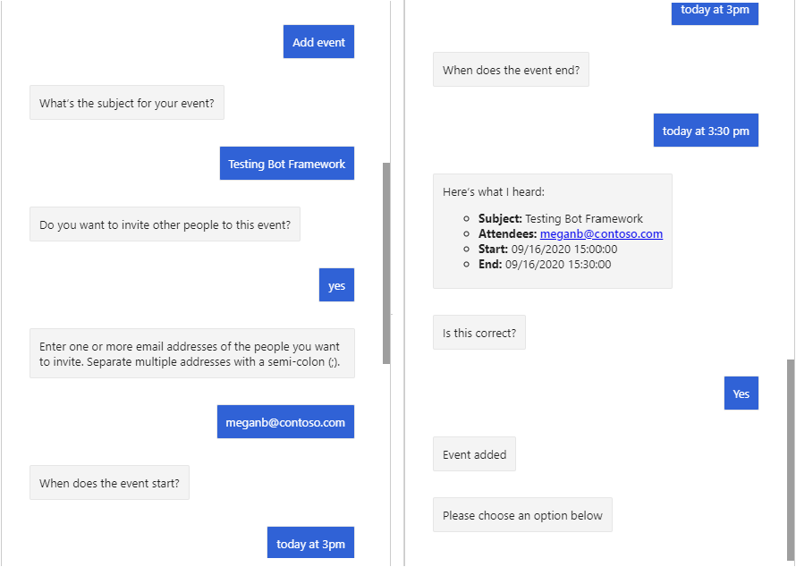

<!-- markdownlint-disable MD002 MD041 -->

En esta sección, usará el SDK de Microsoft Graph para agregar un evento al calendario del usuario.

## <a name="implement-a-dialog"></a>Implementación de un cuadro de diálogo

Empiece por crear un nuevo cuadro de diálogo personalizado para solicitar al usuario los valores necesarios para agregar un evento a su calendario. Este cuadro de diálogo usará una **WaterfallDialog** para realizar los siguientes pasos.

- Solicitar un asunto
- Pregunte si el usuario desea invitar a personas
- Preguntar a los asistentes (si el usuario ha dicho sí en un paso anterior)
- Solicitar una fecha y hora de inicio
- Solicitar una fecha y hora de finalización
- Mostrar todos los valores recopilados y preguntar al usuario para confirmarlo
- Si el usuario confirma que obtiene el token de acceso de **OAuthPrompt**
- Crear el evento

1. Cree un archivo nuevo en el directorio **./Dialogs** denominado **NewEventDialog.CS** y agregue el siguiente código.

    ```csharp
    using System;
    using System.Collections.Generic;
    using System.Threading;
    using System.Threading.Tasks;
    using Microsoft.Bot.Builder;
    using Microsoft.Bot.Builder.Dialogs;
    using Microsoft.Bot.Schema;
    using Microsoft.Extensions.Configuration;
    using Microsoft.Extensions.Logging;
    using Microsoft.Graph;
    using CalendarBot.Graph;
    using Microsoft.Recognizers.Text.DataTypes.TimexExpression;
    using TimexTypes = Microsoft.Recognizers.Text.DataTypes.TimexExpression.Constants.TimexTypes;

    namespace CalendarBot.Dialogs
    {
        public class NewEventDialog : LogoutDialog
        {
            protected readonly ILogger _logger;
            private readonly IGraphClientService _graphClientService;

            public NewEventDialog(
                IConfiguration configuration,
                IGraphClientService graphClientService)
                : base(nameof(NewEventDialog), configuration["ConnectionName"])
            {

            }

            // Generate a DateTime from the list of
            // DateTimeResolutions provided by the DateTimePrompt
            private static DateTime GetDateTimeFromResolutions(IList<DateTimeResolution> resolutions)
            {
                var timex = new TimexProperty(resolutions[0].Timex);

                // Handle the "now" case
                if (timex.Now ?? false)
                {
                    return DateTime.Now;
                }

                // Otherwise generate a DateTime
                return TimexHelpers.DateFromTimex(timex);
            }
        }
    }
    ```

    Se trata del shell de un nuevo cuadro de diálogo en el que se pedirá al usuario los valores necesarios para agregar un evento a su calendario.

1. Agregue la siguiente función a la clase **NewEventDialog** para solicitar al usuario un asunto.

    :::code language="csharp" source="../demo/GraphCalendarBot/Dialogs/NewEventDialog.cs" id="PromptForSubjectSnippet":::

1. Agregue la siguiente función a la clase **NewEventDialog** para almacenar el asunto que el usuario dio en el paso anterior y para preguntarle si desea agregar asistentes.

    :::code language="csharp" source="../demo/GraphCalendarBot/Dialogs/NewEventDialog.cs" id="PromptForAddAttendeesSnippet":::

1. Agregue la siguiente función a la clase **NewEventDialog** para comprobar la respuesta del usuario del paso anterior y solicitar al usuario una lista de asistentes, si es necesario.

    :::code language="csharp" source="../demo/GraphCalendarBot/Dialogs/NewEventDialog.cs" id="PromptForAttendeesSnippet":::

1. Agregue la siguiente función a la clase **NewEventDialog** para almacenar la lista de asistentes del paso anterior (si está presente) y solicitar al usuario una fecha y hora de inicio.

    :::code language="csharp" source="../demo/GraphCalendarBot/Dialogs/NewEventDialog.cs" id="PromptForStartSnippet":::

1. Agregue la siguiente función a la clase **NewEventDialog** para almacenar el valor de inicio del paso anterior y solicitar al usuario una fecha y hora de finalización.

    :::code language="csharp" source="../demo/GraphCalendarBot/Dialogs/NewEventDialog.cs" id="PromptForEndSnippet":::

1. Agregue la siguiente función a la clase **NewEventDialog** para almacenar el valor final del paso anterior y pídale al usuario que confirme todas las entradas.

    :::code language="csharp" source="../demo/GraphCalendarBot/Dialogs/NewEventDialog.cs" id="ConfirmNewEventSnippet":::

1. Agregue la siguiente función a la clase **NewEventDialog** para comprobar la respuesta del usuario del paso anterior. Si el usuario confirma las entradas, use la clase **OAuthPrompt** para obtener un token de acceso. De lo contrario, finalice el cuadro de diálogo.

    :::code language="csharp" source="../demo/GraphCalendarBot/Dialogs/NewEventDialog.cs" id="GetTokenSnippet":::

1. Agregue la siguiente función a la clase **NewEventDialog** para usar el SDK de Microsoft Graph para crear el nuevo evento.

    :::code language="csharp" source="../demo/GraphCalendarBot/Dialogs/NewEventDialog.cs" id="AddEventSnippet":::

    Considere lo que hace este código.

    - Obtiene el **MailboxSettings** del usuario para determinar la zona horaria preferida del usuario.
    - Crea un objeto **Event** con los valores proporcionados por el usuario. Tenga en cuenta que las propiedades **Start** y **End** se establecen con la zona horaria del usuario.
    - Crea el evento en el calendario del usuario.

## <a name="add-validation"></a>Agregar validación

Ahora, agregue validación a la entrada del usuario para evitar errores al crear el evento con Microsoft Graph. Queremos asegurarnos de que:

- Si el usuario proporciona una lista de asistentes, debe ser una lista delimitada por punto y coma de direcciones de correo electrónico válidas.
- La fecha y hora de inicio debe ser una fecha y hora válidas.
- La fecha y hora de finalización deben ser una fecha y hora válidas y deben ser posteriores a la fecha de inicio.

1. Agregue la siguiente función a la clase **NewEventDialog** para validar la entrada del usuario para los asistentes.

    :::code language="csharp" source="../demo/GraphCalendarBot/Dialogs/NewEventDialog.cs" id="AttendeesValidatorSnippet":::

1. Agregue las siguientes funciones a la clase **NewEventDialog** para validar la entrada del usuario para la fecha y hora de inicio.

    :::code language="csharp" source="../demo/GraphCalendarBot/Dialogs/NewEventDialog.cs" id="StartValidatorSnippet":::

1. Agregue la siguiente función a la clase **NewEventDialog** para validar la entrada del usuario para la fecha y hora de finalización.

    :::code language="csharp" source="../demo/GraphCalendarBot/Dialogs/NewEventDialog.cs" id="EndValidatorSnippet":::

## <a name="add-steps-to-waterfalldialog"></a>Agregar pasos a WaterfallDialog

Ahora que tiene todos los "pasos" del cuadro de diálogo, el último paso consiste en agregarlos a un **WaterfallDialog** en el constructor y, a continuación, agregar el **NewEventDialog** a **MainDialog**.

1. Busque el constructor **NewEventDialog** y agréguele el código siguiente.

    :::code language="csharp" source="../demo/GraphCalendarBot/Dialogs/NewEventDialog.cs" id="ConstructorSnippet":::

    Esto agrega todos los cuadros de diálogo que se usan y agrega todas las funciones que ha implementado como pasos en el **WaterfallDialog**.

1. Abra **./Dialogs/MainDialog.CS** y agregue la línea siguiente al constructor.

    ```csharp
    AddDialog(new NewEventDialog(configuration, graphClientService));
    ```

1. Reemplace el código dentro del `else if (command.StartsWith("add event"))` bloque `ProcessStepAsync` por lo siguiente.

    :::code language="csharp" source="../demo/GraphCalendarBot/Dialogs/MainDialog.cs" id="AddEventSnippet" highlight="3":::

1. Guarde todos los cambios y reinicie el bot.

1. Use el emulador de bot Framework para conectarse al bot e inicie sesión. Seleccione el botón **Agregar evento** .

1. Responda a los mensajes para crear un nuevo evento. Tenga en cuenta que cuando se solicitan los valores de inicio y de finalización, puede usar frases como "hoy a las 15:00" o "ahora".

    
